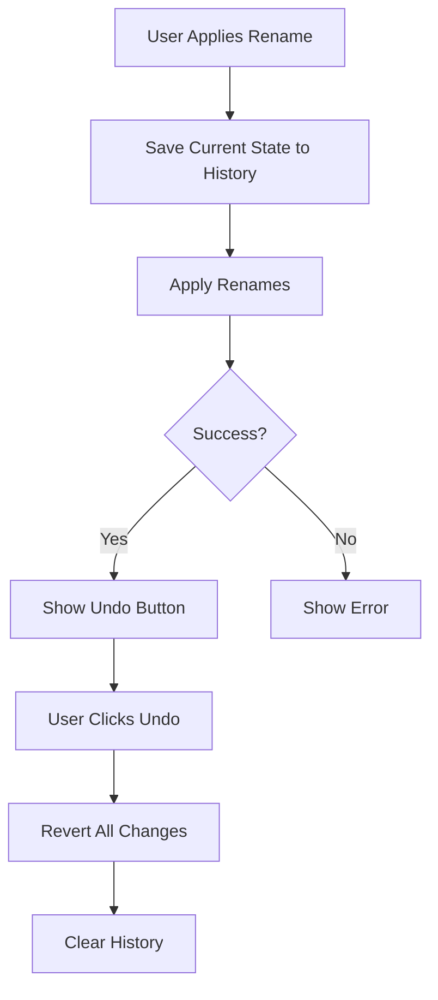
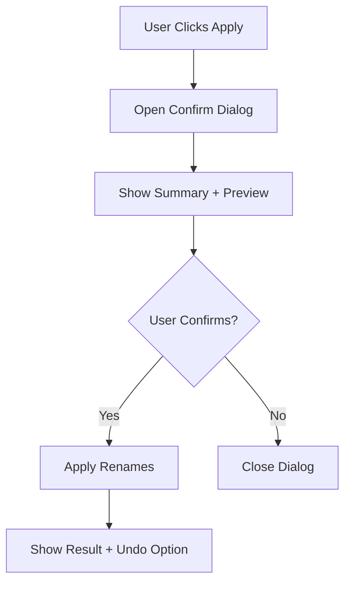

# پلن بهبود UX - فاز ۲

## خلاصه

این پلن شامل ۴ بخش اصلی است:

1. سیستم Undo برای برگشت از عملیات
2. دیالوگ تأیید برای جلوگیری از اشتباهات
3. بازطراحی کامپوننت‌های Theme و Language
4. ایده‌های آینده برای توسعه

---

## ۱. سیستم Undo 🔄

### هدف

امکان برگشت به حالت قبل در صورت اشتباه در تغییر نام

### معماری



### تغییرات مورد نیاز

#### A. تایپ‌های جدید [`types/index.ts`](types/index.ts)

```typescript
// اضافه کردن به فایل types/index.ts

export interface RenameHistoryEntry {
  id: string;
  timestamp: number;
  pairs: RenamePair[]; // from: newPath, to: oldPath (for undo)
  originalPairs: RenamePair[]; // from: oldPath, to: newPath (for reference)
  folder: string;
  description: string;
}

export interface UndoResult {
  success: boolean;
  restoredCount: number;
  error?: string;
}
```

#### B. سرویس Undo جدید [`lib/services/undo-service.ts`](lib/services/undo-service.ts)

```typescript
export class UndoService {
  private static history: RenameHistoryEntry[] = [];
  private static readonly MAX_HISTORY = 10;

  // Add rename operation to history
  static addToHistory(entry: RenameHistoryEntry): void;

  // Get last operation for undo
  static getLastOperation(): RenameHistoryEntry | null;

  // Check if undo is available
  static canUndo(): boolean;

  // Clear history
  static clearHistory(): void;

  // Perform undo
  static async undo(): Promise<UndoResult>;
}
```

#### C. کامپوننت UndoButton [`components/UndoButton.tsx`](components/UndoButton.tsx)

- نمایش دکمه با انیمیشن
- نمایش تعداد فایل‌های قابل برگشت
- نمایش زمان عملیات (مثلاً "۲ دقیقه پیش")

#### D. تغییرات در Tauri Backend [`src-tauri/src/commands/undo.rs`](src-tauri/src/commands/undo.rs)

```rust
// دستور جدید برای برگرداندن تغییرات
#[tauri::command]
async fn undo_renames(pairs: Vec<RenamePair>) -> Result<UndoResult, String>;
```

### UI Design

```
┌────────────────────────────────────────┐
│  ✅ ۱۲ فایل با موفقیت تغییر نام یافت  │
│                                        │
│  [🔄 برگشت - ۱۲ فایل] [بستن]          │
│                                        │
│  عملیات ۲ دقیقه پیش انجام شد          │
└────────────────────────────────────────┘
```

---

## ۲. دیالوگ تأیید تغییر نام ⚠️

### هدف

جلوگیری از اشتباهات با نمایش خلاصه تغییرات قبل از اعمال

### معماری



### کامپوننت‌های مورد نیاز

#### A. ConfirmRenameDialog [`components/ConfirmRenameDialog.tsx`](components/ConfirmRenameDialog.tsx)

استفاده از [`AlertDialog`](components/ui/alert-dialog.tsx) موجود

**ویژگی‌ها:**

- نمایش تعداد فایل‌های تغییر نام یافته
- نمایش تعداد تداخل‌ها
- لیست قابل اسکرول از تغییرات
- دکمه‌های "تأیید" و "انصراف"

### UI Design

```
┌─────────────────────────────────────────────────────────┐
│  ⚠️ تأیید تغییر نام                                    │
├─────────────────────────────────────────────────────────┤
│                                                         │
│  خلاصه:                                                │
│  • ۱۲ فایل تغییر خواهد کرد                             │
│  • ۰ تداخل وجود دارد                                   │
│                                                         │
│  نمونه تغییرات:                                        │
│  ┌─────────────────────────────────────────────────┐   │
│  │ Breaking.Bad.S01E01.mkv                        │   │
│  │ ↓                                               │   │
│  │ Breaking Bad - S01E01.mkv                      │   │
│  │                                                 │   │
│  │ Breaking.Bad.S01E01.srt                        │   │
│  │ ↓                                               │   │
│  │ Breaking Bad - S01E01.srt                      │   │
│  └─────────────────────────────────────────────────┘   │
│                                                         │
│              [انصراف]  [تأیید - ۱۲ فایل]              │
└─────────────────────────────────────────────────────────┘
```

---

## ۳. بازطراحی ThemeToggle 🌙

### هدف

استفاده از UI مدرن shadcn با Dropdown مناسب

### تغییرات

#### A. کامپوننت جدید [`components/ThemeToggle.tsx`](components/ThemeToggle.tsx)

**ویژگی‌های جدید:**

- استفاده از [`Button`](components/ui/button.tsx) با [`variant="outline"`](components/ui/button.tsx)
- آیکون فعال با انیمیشن چرخش
- نمایش نام تم انتخابی در کنار آیکون
- استفاده از [`DropdownMenu`](components/ui/dropdown-menu.tsx) استاندارد

### UI Design

```
┌─────────────────┐
│ 🌙 Light   ▼    │
└─────────────────┘
        │
        ▼
┌─────────────────┐
│ ☀️ Light        │
│ 🌙 Dark         │
│ 💻 System       │
└─────────────────┘
```

---

## ۴. بازطراحی LanguageToggle 🌐

### هدف

استفاده از UI مدرن shadcn مشابه ThemeToggle

### تغییرات

#### A. کامپوننت جدید [`components/LanguageToggle.tsx`](components/LanguageToggle.tsx)

**ویژگی‌های جدید:**

- استفاده از [`Button`](components/ui/button.tsx) با [`variant="outline"`](components/ui/button.tsx)
- نمایش پرچم یا کد زبان (IR/EN)
- نمایش نام زبان کامل

### UI Design

```
┌─────────────────┐
│ 🇮🇷 فارسی   ▼    │
└─────────────────┘
        │
        ▼
┌─────────────────┐
│ 🇬🇧 English      │
│ 🇮🇷 فارسی        │
└─────────────────┘
```

---

## ۵. پلن آینده - ایده‌های کاربردی 🚀

### فاز ۳: قابلیت‌های پیشرفته

#### A. قابلیت Preset/Template 💾

**مشکل:** کاربر مجبور است هر بار الگوهای پرکاربرد را دوباره وارد کند

**راه‌حل:** ذخیره الگوهای پرکاربرد

```typescript
interface RenamePreset {
  id: string;
  name: string;
  pattern: string;
  metadata: SeriesMetadata;
  tags: string[];
}

// مثال:
// • "Breaking Bad Style" → "Breaking.Bad.S01E01"
// • "Persian Style" → "قسمت ۰۱ - Breaking Bad"
// • "Plex Standard" → "Breaking Bad - S01E05"
```

**UI:**

```
[+] [💾 ذخیره الگو] [📂 الگوهای من ▼]
            │
            ▼
    ┌─────────────────┐
    │ ⭐ Breaking Bad  │
    │ ⭐ Game of Thrones│
    │ ─────────────── │
    │ 🕐 اخیراً استفاده │
    └─────────────────┘
```

---

#### B. Drag & Drop ویرایش 🖱️

**مشکل:** ترتیب فایل‌ها گاهی اشتباه است

**راه‌حل:** امکان کشیدن و رها کردن فایل‌ها برای تغییر ترتیب

```
┌────────────────────────────────────────┐
│  ☰  E01 - Breaking Bad.mkv    [×]    │
│  ☰  E02 - Breaking Bad.mkv    [×]    │ ← قابل جابجایی
│  ☰  E03 - Breaking Bad.mkv    [×]    │
└────────────────────────────────────────┘
```

---

#### C. پیش‌نمایش Thumbnail 🖼️

**مشکل:** نمی‌توان فایل ویدیو را از نام تشخیص داد

**راه‌حل:** نمایش thumbnail فریم اول ویدیو

```
┌────────────────────────────────────────┐
│  ┌────┐                                │
│  │ 🖼️ │  Breaking Bad - S01E01.mkv    │
│  └────┘                                │
│  ┌────┐                                │
│  │ 🖼️ │  Breaking Bad - S01E02.mkv    │
│  └────┘                                │
└────────────────────────────────────────┘
```

**تکنولوژی:** Tauri API برای خواندن فریم اول ویدیو

---

#### D. تاریخچه تغییرات 📜

**مشکل:** نمی‌دانید قبلاً چه تغییراتی داده‌اید

**راه‌حل:** ذخیره تاریخچه تمام renameها

```typescript
interface RenameLog {
  id: string;
  timestamp: Date;
  folder: string;
  changes: RenamePair[];
  success: boolean;
}

// نمایش در UI:
// ┌────────────────────────────────────────┐
// │ 📜 تاریخچه تغییرات                    │
// ├────────────────────────────────────────┤
// │ • ۲ ساعت پیش - ۱۲ فایل - موفق ✓       │
// │ • دیروز - ۵ فایل - موفق ✓             │
// │ • ۳ روز پیش - ۸ فایل - خطا ✗           │
// └────────────────────────────────────────┘
```

---

#### E. تشخیص خودکار اطلاعات از OMDB/TMDB 🔍

**مشکل:** وارد کردن دستی نام سریال و فصل

**راه‌حل:**

1. کاربر نام سریال را وارد می‌کند
2. جستجو در API TMDB
3. پیشنهاد نام صحیح و پوستر
4. تشخیص خودکار فصل از نام فایل‌ها

```
┌────────────────────────────────────────┐
│ نام سریال: [Breaking Bad        ] 🔍  │
├────────────────────────────────────────┤
│ نتایج جستجو:                           │
│ ┌──────────────────────────────────┐  │
│ │ 🖼️  Breaking Bad (2008-2013)     │  │
│ │     درام | جنایی | ۵ فصل         │  │
│ └──────────────────────────────────┘  │
└────────────────────────────────────────┘
```

---

#### F. حالت Batch Advanced 🔧

**مشکل:** تغییر نام چندین فصل به صورت همزمان

**راه‌حل:**

```
┌────────────────────────────────────────┐
│ پوشه: /Downloads/Breaking Bad/         │
├────────────────────────────────────────┤
│ Season 01/  ← ۱۳ فایل شناسایی شد      │
│ Season 02/  ← ۱۳ فایل شناسایی شد      │
│ Season 03/  ← ۱۳ فایل شناسایی شد      │
│                                        │
│ [✅] Season 01  [✅] Season 02        │
│ [✅] Season 03  [⬜] Extras           │
│                                        │
│ الگو: {series} - S{season}E{episode}  │
└────────────────────────────────────────┘
```

---

#### G. سیستم Conflict Resolution ⚔️

**مشکل:** تداخل نام‌ها

**راه‌حل‌های پیشنهادی:**

1. **Auto-suffix:** اضافه کردن (1), (2) به نام
2. **Smart-merge:** ترکیب فایل‌های هم‌نام
3. **Interactive:** نمایش dialog برای انتخاب

```
┌────────────────────────────────────────┐
│ ⚠️ تداخل نام شناسایی شد               │
├────────────────────────────────────────┤
│ دو فایل به نام یکسان تغییر می‌کنند:    │
│                                        │
│ 1. video.s01e01.1080p.mkv             │
│ 2. video.s01e01.720p.mkv              │
│                                        │
│ [ادغام با suffix] [رد کردن یکی]        │
│ [ادغام هوشمند] [نمایش جزئیات]        │
└────────────────────────────────────────┘
```

---

#### H. میانبرهای کیبورد ⌨️

| میانبر     | عملیات         |
| ---------- | -------------- |
| Ctrl+Enter | اعمال تغییرات  |
| Ctrl+Z     | Undo           |
| Ctrl+R     | بازخوانی پوشه  |
| Ctrl+A     | انتخاب همه     |
| Delete     | حذف انتخاب     |
| Escape     | بستن dialog    |
| F2         | تغییر نام دستی |

---

#### I. قابلیت Search & Filter 🔎

```
┌────────────────────────────────────────┐
│ جستجو: [                    ] 🔍      │
│ فیلتر: [همه ▼] [ویدیو ▼] [سالم ▼]     │
├────────────────────────────────────────┤
│ • ۱۲ نتیجه برای "s01e01"              │
└────────────────────────────────────────┘
```

---

#### J. Export/Import تنظیمات 📤

**برای:** پشتیبان‌گیری و اشتراک‌گذاری الگوها

```typescript
// Export به JSON
{
  "presets": [...],
  "settings": {...},
  "history": [...]
}
```

---

## جدول اولویت‌ها

| #   | ویژگی               | اولویت   | زمان‌برآورد |
| --- | ------------------- | -------- | ----------- |
| 1   | سیستم Undo          | 🔴 بالا  | -           |
| 2   | دیالوگ تأیید        | 🔴 بالا  | -           |
| 3   | بازطراحی Toggleها   | 🟡 متوسط | -           |
| 4   | Preset/Template     | 🟡 متوسط | -           |
| 5   | Drag & Drop         | 🟡 متوسط | -           |
| 6   | Thumbnail Preview   | 🟢 پایین | -           |
| 7   | تاریخچه             | 🟢 پایین | -           |
| 8   | TMDB Integration    | 🟢 پایین | -           |
| 9   | Batch Advanced      | 🟢 پایین | -           |
| 10  | Conflict Resolution | 🟢 پایین | -           |

---

## نکات فنی

### ذخیره‌سازی محلی

استفاده از localStorage برای:

- تنظیمات کاربر
- Presetها
- تاریخچه کوتاه‌مدت

### Backend (Rust)

نیاز به دستورات جدید:

- `undo_renames`: برگرداندن تغییرات
- `extract_thumbnail`: استخراج thumbnail
- `get_video_info`: اطلاعات ویدیو

### Dependencies پیشنهادی

```json
{
  "@dnd-kit/core": "^6.0.0",
  "fuse.js": "^7.0.0",
  "date-fns": "^3.0.0"
}
```
