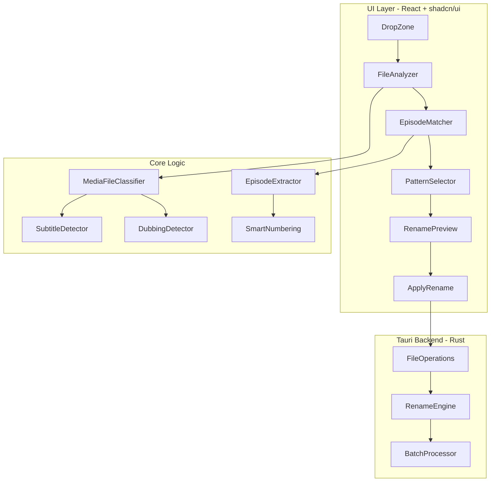

# پلن خلاقانه توسعه رینامیک برای سریال‌ها

## معماری کلی سیستم



## قابلیت‌های کلیدی جدید

### 1. سیستم تشخیص هوشمند فایل‌ها (MediaFileClassifier)

| نوع فایل | پسوندهای شناسایی                       | رنگ UI     |
| -------- | -------------------------------------- | ---------- |
| ویدیو    | `.mp4`, `.mkv`, `.avi`, `.mov`, `.wmv` | 🔵 آبی     |
| زیرنویس  | `.srt`, `.ass`, `.ssa`, `.vtt`, `.sub` | 🟢 سبز     |
| دوبله    | `.mka`, `.ac3`, `.dts`, `.aac`         | 🟡 نارنجی  |
| سایر     | بقیه                                   | ⚪ خاکستری |

**ویژگی:** وقتی یه فایل ویدیو انتخاب می‌شه، سیستم به صورت خودکار دنبال فایل‌های زیرنویس و دوبله با نام مشابه می‌گرده.

### 2. استخراج خودکار اطلاعات قسمت (EpisodeExtractor)

الگوهای Regex برای شناسایی:

- `S01E05` یا `s01e05`
- `1x05` یا `01x05`
- `Episode 5` یا `Ep 5`
- `E05` یا `e05`
- `05` (فقط عدد دو رقمی)

**مثال هوشمندانه:**

```
ورودی: "Breaking.Bad.S01E05.1080p.BluRay.mkv"
استخراج: { series: "Breaking Bad", season: 1, episode: 5 }
```

### 3. پترن‌های نام‌گذاری قابل انتخاب (PatternSelector)

| پترن                             | خروجی                           |
| -------------------------------- | ------------------------------- |
| `{series} - S{season}E{episode}` | Breaking Bad - S01E05           |
| `{series} - {season}x{episode}`  | Breaking Bad - 1x05             |
| `S{season}E{episode} - {series}` | S01E05 - Breaking Bad           |
| `{series} - قسمت {episode}`      | Breaking Bad - قسمت 05          |
| `{series}.S{season}E{episode}`   | Breaking Bad.S01E05             |
| سفارشی                           | کاربر خودش الگو رو تعریف می‌کنه |

### 4. سیستم گروه‌بندی فایل‌ها (FileGroup)

هر گروه شامل:

- 1 فایل اصلی (ویدیو)
- N فایل زیرنویس (زبان‌های مختلف)
- N فایل دوبله (نسخه‌های مختلف)

```typescript
interface FileGroup {
  id: string;
  episode?: number;
  season?: number;
  mainFile: FileEntry;
  subtitles: FileEntry[];
  dubs: FileEntry[];
  others: FileEntry[];
}
```

### 5. پیش‌نمایش پیشرفته (AdvancedPreview)

UI جدید با:

- نمایش گروهی فایل‌ها
- رنگ‌بندی نوع فایل
- نمایش وضعیت هر گروه
- امکان ویرایش دستی نام هر فایل

## ساختار فایل‌های پروژه

```
app/
├── page.tsx                    # صفحه اصلی
├── layout.tsx                  # لای‌اوت اصلی
├── globals.css                 # استایل‌های گلوبال
├── sections/
│   ├── SeriesRenamerSection.tsx    # بخش اصلی تغییر نام سریال
│   └── BatchRenamerSection.tsx     # بخش تغییر نام ساده (فعلی)
├── components/
│   ├── FileGroupList.tsx       # لیست گروه‌های فایل
│   ├── EpisodePatternEditor.tsx # ویرایشگر پترن نام‌گذاری
│   ├── SeriesMetadataForm.tsx  # فرم اطلاعات سریال
│   └── FileTypeBadge.tsx       # نشانگر نوع فایل

lib/
├── rename-rules.ts             # قوانین تغییر نام فعلی
├── file-classifier.ts          # کلاس‌بندی فایل‌ها
├── episode-extractor.ts        # استخراج اطلاعات قسمت
├── file-matcher.ts             # تطبیق فایل‌های مرتبط
└── patterns/
    ├── series-patterns.ts      # پترن‌های آماده سریال
    └── custom-pattern.ts       # سازنده پترن سفارشی

components/ui/                  # کامپوننت‌های shadcn
├── (موجود)                     # کامپوننت‌های فعلی
├── accordion.tsx               # جدید: برای گروه‌بندی
├── badge.tsx                   # موجود - استفاده برای نوع فایل
├── checkbox.tsx                # موجود
├── collapsible.tsx             # جدید: برای نمایش/مخفی کردن
├── radio-group.tsx             # جدید: انتخاب پترن
├── slider.tsx                  # جدید: برای تعداد رقم
├── switch.tsx                  # جدید: تغییر حالت
└── tooltip.tsx                 # جدید: راهنمای ابزار

types/
├── index.ts                    # تایپ‌های فعلی
└── series.ts                   # تایپ‌های جدید سریال

src-tauri/src/
├── main.rs                     # نقطه ورود
├── commands/
│   ├── mod.rs
│   ├── file_ops.rs             # عملیات فایل فعلی
│   └── batch_rename.rs         # تغییر نام دسته‌ای جدید
└── models/
    ├── mod.rs
    └── file_group.rs           # مدل گروه فایل
```

## رابط کاربری پیشنهادی (UI Design)

### نمای کلی صفحه

```
┌─────────────────────────────────────────────────────────────┐
│  🎬 رینامیک - تغییر نام سریال          [🌙] [🇮🇷] [⚙️]    │
├─────────────────────────────────────────────────────────────┤
│                                                             │
│  ┌─────────────────────────────────────────────────────┐   │
│  │  📁 پوشه فعال: /Users/amir/Downloads/Breaking Bad   │   │
│  └─────────────────────────────────────────────────────┘   │
│                                                             │
│  ┌─────────────────────────────────────────────────────┐   │
│  │  [🔍 جستجوی فایل‌ها...]                            │   │
│  │                                                     │   │
│  │  نام سریال: [Breaking Bad                    ]     │   │
│  │  فصل:        [1    ]    شروع از قسمت: [1    ]     │   │
│  │                                                     │   │
│  │  الگوی نام‌گذاری:                                   │   │
│  │  ○ {series} - S{season}E{episode}                   │   │
│  │  ○ {series} - قسمت {episode}                        │   │
│  │  ● سفارشی: [Breaking.Bad.S##E##                 ]  │   │
│  └─────────────────────────────────────────────────────┘   │
│                                                             │
│  ┌─────────────────────────────────────────────────────┐   │
│  │  📊 پیش‌نمایش تغییرات                              │   │
│  │                                                     │   │
│  │  ▼ Breaking Bad - S01E01.mp4  (ویدیو)              │   │
│  │    ├─ Breaking Bad - S01E01.srt  (زیرنویس) ✓       │   │
│  │    └─ Breaking Bad - S01E01.mka  (دوبله)   ✓       │   │
│  │                                                     │   │
│  │  ▶ breaking.bad.s01e02.1080p.mkv  (ویدیو)          │   │
│  │    ├─ breaking.bad.s01e02.Fa.srt  (زیرنویس) ✓     │   │
│  │    └─ breaking.bad.s01e02.En.srt  (زیرنویس) ✓     │   │
│  │                                                     │   │
│  │  ⚠️ هشدار: فایل زیرنویس برای E03 یافت نشد!         │   │
│  └─────────────────────────────────────────────────────┘   │
│                                                             │
│  ┌─────────────────────────────────────────────────────┐   │
│  │  ✅ 12 فایل آماده تغییر نام  [✨ اعمال تغییرات]      │   │
│  └─────────────────────────────────────────────────────┘   │
│                                                             │
└─────────────────────────────────────────────────────────────┘
```

### جزئیات UI

1. **FileGroupCard**: کارت گروه فایل با قابلیت باز/بسته شدن
2. **FileTypeBadge**: نشانگر رنگی نوع فایل (آبی/سبز/نارنجی)
3. **EpisodeInput**: ورودی شماره قسمت با قابلیت افزایش/کاهش
4. **PatternPreview**: نمایش لحظه‌ای نتیجه الگو
5. **ConflictWarning**: هشدار تداخل با آیکون ⚠️

## الگوریتم‌های کلیدی

### الگوریتم تطبیق فایل‌ها

```typescript
function matchRelatedFiles(videoFile: FileEntry, allFiles: FileEntry[]): RelatedFiles {
  const baseName = extractBaseName(videoFile.name);

  return {
    subtitles: allFiles.filter((f) => isSubtitle(f) && isSimilarName(baseName, f.name)),
    dubs: allFiles.filter((f) => isDubbing(f) && isSimilarName(baseName, f.name)),
  };
}

function isSimilarName(base: string, candidate: string): boolean {
  // حذف پسوند
  const baseWithoutExt = base.replace(/\.[^.]+$/, '');
  const candidateWithoutExt = candidate.replace(/\.[^.]+$/, '');

  // محاسبه شباهت (Levenshtein یا fuzzy match)
  const similarity = calculateSimilarity(normalize(baseWithoutExt), normalize(candidateWithoutExt));

  return similarity > 0.8;
}
```

### الگوریتم استخراج اطلاعات قسمت

```typescript
const EPISODE_PATTERNS = [
  { regex: /[Ss](\d+)[Ee](\d+)/, season: 1, episode: 2 }, // S01E05
  { regex: /(\d+)[xX](\d+)/, season: 1, episode: 2 }, // 1x05
  { regex: /[Ee]p?(?:isode)?\s*(\d+)/i, episode: 1 }, // Ep 5, Episode 5
  { regex: /\b(\d{1,2})\b/, episode: 1 }, // عدد تنها
];

function extractEpisodeInfo(filename: string): EpisodeInfo | null {
  for (const pattern of EPISODE_PATTERNS) {
    const match = filename.match(pattern.regex);
    if (match) {
      return {
        season: pattern.season ? parseInt(match[pattern.season]) : undefined,
        episode: parseInt(match[pattern.episode]),
      };
    }
  }
  return null;
}
```

## مراحل اجرای پروژه

### فاز 1: آماده‌سازی و تایپ‌ها

1. تعریف تایپ‌های جدید در `types/series.ts`
2. ایجاد utilهای پایه در `lib/file-classifier.ts`
3. اضافه کردن کامپوننت‌های UI جدید shadcn

### فاز 2: منطق اصلی

1. پیاده‌سازی `episode-extractor.ts`
2. پیاده‌سازی `file-matcher.ts`
3. ایجاد سیستم پترن‌ها در `lib/patterns/`

### فاز 3: کامپوننت‌های UI

1. ایجاد `FileGroupList.tsx`
2. ایجاد `SeriesMetadataForm.tsx`
3. ایجاد `EpisodePatternEditor.tsx`

### فاز 4: یکپارچه‌سازی

1. به‌روزرسانی صفحه اصلی
2. اتصال به بک‌اند Tauri
3. تست و دیباگ

### فاز 5: بهبودها

1. افزودن undo/redo
2. ذخیره تنظیمات کاربر
3. پشتیبانی از زبان‌های بیشتر در استخراج نام

## نکات خلاقانه و UX

1. **حالت هوشمند**: وقتی کاربر پوشه سریال رو انتخاب می‌کنه، سیستم خودکار:
   - نام سریال رو از نام پوشه یا فایل‌ها حدس می‌زنه
   - شماره فصل و قسمت‌ها رو استخراج می‌کنه
   - فایل‌های زیرنویس و دوبله رو گروه‌بندی می‌کنه

2. **پیش‌نمایش زنده**: با تایپ هر حرف در الگو، نتیجه روی فایل‌های واقعی نشون داده می‌شه

3. **هشدارهای هوشمند**:
   - اگه فایل ویدیو زیرنویس نداشته باشه ⚠️
   - اگه شماره قسمت‌ها تکراری باشه ❌
   - اگه فایل با نام جدید وجود داشته باشه ⚠️

4. **میانبرهای کیبورد**:
   - `Ctrl+Enter`: اعمال تغییرات
   - `Ctrl+Z`: بازگردانی
   - `Tab`: جابجایی بین فیلدها

## تکنولوژی‌های پیشنهادی اضافی

- **fuse.js**: برای جستجوی فازی در نام فایل‌ها
- **date-fns**: برای فرمت تاریخ در نام فایل‌ها (اختیاری)
- **@tauri-apps/api/fs**: برای عملیات پیشرفته فایل در Rust
